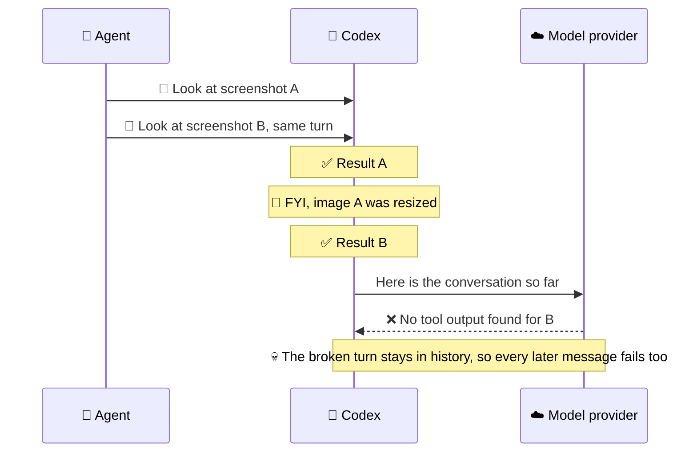
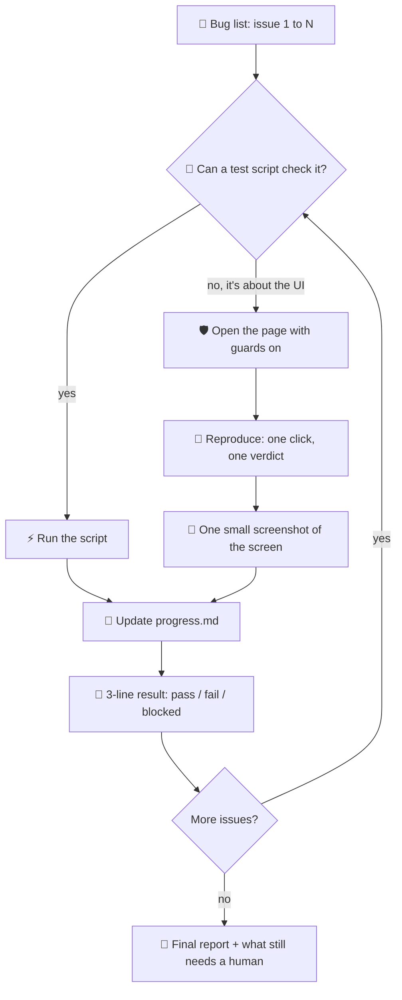

<div align="center">

# 🔓 unstuck-qa

**A browser-testing skill that keeps your AI agent from freezing mid-test.**

*让 AI 智能体在网页上测 bug 时，不再卡死、不再空转。*

<br>


[🍝 Story](#-the-story) · [💥 The bug](#-the-bug-that-ate-my-session) · [✨ What it does](#-what-this-skill-teaches-your-agent) · [🔄 How it flows](#-how-a-test-run-flows) · [📦 Install](#-install-in-30-seconds) · [🧯 Already broken?](#-help-my-session-is-already-dead)

</div>

---

> [!TIP]
> **Got this error? You're in the right place.** 👇
>
> ```text
> No tool output found for tool call call_01_...
> ```

## 🍝 The story

I was letting an AI agent (Codex) work through a bug list on a real web app: open a page, click around, save, take a screenshot, next bug.

Things were going fine. Then it looked at **two screenshots at the same time**, and this showed up:

```text
No tool output found for tool call call_01_...
```

I sent another message. Same error. And another. Same error. 🫠

The whole session was toast. 🍞🔥 All that progress, gone.

So I opened the logs, found out what actually happened, and packed every lesson into this skill.

> 🇨🇳 **中文摘要：** 我让 AI（Codex）在真实网页上按缺陷清单逐个测试。本来一切正常，直到它**同时看了两张截图**，就出现了上面这个报错。之后不管发什么，都是同一个错，整个会话彻底报废。于是我翻日志找到了真正的原因，把踩过的坑全写进了这个技能。

## 💥 The bug that ate my session

Here's what really happened. (Spoiler: nothing was actually lost. 👀)



### 🍜 The restaurant version

Picture a waiter carrying two bowls to a very strict kitchen.

The kitchen's rule: **both bowls must arrive back to back.**

Bowl A was too big, so the waiter shrank it and left a little note on the counter saying so. 📝 The note landed **right between the two bowls.**

The kitchen sees *bowl A → note → ...* and yells **"Where's bowl B?!"**, even though bowl B is right there.

Worse, the kitchen keeps that receipt forever, so **every order after that** gets rejected the same way.

### 🧪 The recipe for disaster

It takes all three ingredients to cook this bug:

| | Ingredient | What that means |
|:---:|---|---|
| 1️⃣ | Two images in one turn | The agent looks at two screenshots at once |
| 2️⃣ | A big image | Codex shrinks it for you and adds a little "resized" note |
| 3️⃣ | A strict provider | Some model services (I hit it with DeepSeek) insist tool results sit back to back |

Take away **any one** and the bug can't happen. This skill takes away **two**, just to be safe: ✂️

- **one image per message**
- **shrink images yourself before looking**

> 🔬 Seen with Codex CLI + DeepSeek, September 2026. Other setups may behave differently. If you hit it somewhere else, please open an issue!

> 🇨🇳 **中文摘要：** 截图结果其实并没有丢。问题在于：第一张图太大，Codex 自动缩放后插了一条「图片已缩放」的提示，刚好夹在两条结果中间。有些模型服务（我遇到的是 DeepSeek）要求工具结果必须紧挨着排列，一看中间夹了东西，就认定第二张图「没有返回」。这条坏记录会一直留在历史里，所以之后每条消息都报同样的错。三个条件缺一个就不会触发：同时看两张图、图片大到需要缩放、模型服务对顺序很严格。这个技能一次去掉两个：一次只看一张图，看之前先自己把图压小。

## ✨ What this skill teaches your agent

| | Rule | Why, in plain words |
|:---:|---|---|
| 🖼️ | One image per message | Dodges the session-killer above |
| 📐 | Screenshot only what's on screen, max 1500 px wide | Giant full-page shots are slow, get auto-resized, and feed the bug |
| 🤐 | Never dump the whole page's text | A wall of text buries the one thing that matters |
| ⏱️ | Wait for something specific, with a timeout | "Wait until the page is calm" never happens on pages that auto-refresh |
| 🛑 | A step didn't come back? Stop | Piling on more steps turns one glitch into a dead session |
| 💬 | Handle pop-ups before clicking | A hidden "Are you sure?" dialog can freeze a click forever |
| 💾 | Save once, get one verdict | No endless "refresh and try again" loops |
| 📒 | Write down progress after every bug | If a session dies, the next one picks up where it left off |
| 🧪 | Skip the browser when you can | A test script checks the same thing in about 10× fewer steps |

<details>
<summary>🇨🇳 <b>中文摘要</b>（点开查看）</summary>

<br>

- 🖼️ **一次只看一张图**：避开上面那个会话杀手
- 📐 **只截当前屏幕，宽度不超过 1500 像素**：整页长图又慢，又会被自动缩放，正好触发 bug
- 🤐 **不要把整页文字全倒出来**：信息太多，关键的反而看不到
- ⏱️ **等一个具体的东西出现，并设超时**：会自动刷新的页面永远等不到「安静下来」
- 🛑 **某一步没返回就停手**：继续堆操作，只会把小故障变成整个会话报废
- 💬 **点击前先处理弹窗**：看不见的「确定吗？」弹窗会让点击一直卡住
- 💾 **保存只点一次，当场下结论**：不陷入「刷新再试」的死循环
- 📒 **每测完一个 bug 就记进度**：会话坏了，新会话接着测，不用从头来
- 🧪 **能不用浏览器就不用**：测试脚本检查同样的问题，步骤少十倍左右

</details>

## 🔄 How a test run flows



Step by step:

1. **📄 Read the bug list.** Each issue gets its own mini test.
2. **🧪 Try the easy way first.** If a unit test or an API call can check it, do that. Faster, and way less likely to get stuck.
3. **🛡️ Put the guards on.** Before touching the page: auto-handle pop-up dialogs, switch off "are you sure you want to leave?" traps, and set short timeouts.
4. **🔁 Reproduce.** Go straight to the exact URL. For save buttons, note what the page looks like, click **once**, then record the message, the server's answer, and any console errors. That's the verdict.
5. **📸 Grab evidence.** One screenshot at a time, visible screen only, shrunk to 1500 px wide or less.
6. **📒 Update progress.** Write the result to `progress.md` right away.
7. **🧾 Report.** Three lines per issue (result, reason, evidence), plus a list of anything a human should double-check.

> 🇨🇳 **中文摘要：** 先读缺陷清单。能用测试脚本或接口检查的，就不开浏览器；必须看界面的，先装好「弹窗处理、离页拦截、短超时」这些保护，再用完整网址直接打开页面复现。保存类操作只点一次，同时记下提示文案、服务器返回和控制台报错，当场下结论。截图一次一张、只截当前屏幕、先压小。每测完一个问题就写进 `progress.md`，最后每个问题用三行汇报，并列出需要人工再确认的地方。

## 📦 Install in 30 seconds

Pick your agent and run one line:

```bash
# 🟢 Codex
git clone https://github.com/Kar23232/unstuck-qa ~/.codex/skills/unstuck-qa

# 🟠 Claude Code
git clone https://github.com/Kar23232/unstuck-qa ~/.claude/skills/unstuck-qa
```

Start a new session and ask your agent *"what skills do you have?"*. If `unstuck-qa` shows up, you're good. ✅

Then just ask for it:

> 💬 *"Use unstuck-qa to reproduce issues 5–8 in `bugs.md` on http://localhost:3000"*

> 🇨🇳 **中文摘要：** 选你用的 agent，运行对应的一行命令就装好了。开一个新会话，问一句「你有哪些技能？」，看到 `unstuck-qa` 就说明生效了。使用时直接说：「用 unstuck-qa 测 bugs.md 里的问题 5–8」。

## 🧯 Help, my session is already dead!

If every message comes back with `No tool output found for tool call ...` and the **same** call ID every time:

- ❌ **Don't retry** in the same session. The broken history gets sent again every time.
- ❌ **Don't resume** it either. Same history, same error.
- ✅ **Start a fresh session.** If you were using this skill, your progress lives in `progress.md`, so the new session picks up at the next unfinished issue. 🙌

> 🇨🇳 **中文摘要：** 如果每条消息都报同一个 call ID 的 `No tool output found`，不要在原会话里重试，也不要 resume，因为坏记录每次都会被重新发送。直接开一个新会话。用了这个技能的话，进度都记在 `progress.md` 里，新会话会从下一个没测完的问题接着测。

## 📁 What's inside

```text
unstuck-qa/
├── SKILL.md                     🧠 the rules your agent follows
├── README.md                    👋 you are here
├── examples/
│   └── real-project-notes.md    🗺️ traps from a real data-entry web app
└── LICENSE                      📜 MIT
```

> 🇨🇳 **中文摘要：** `SKILL.md` 是给 agent 看的规则；`examples/` 里是在真实项目中踩过的坑，已做匿名处理。

## 🙋 FAQ

**Do I need to use DeepSeek for this to matter?**
Nope. The session-killer showed up with DeepSeek for me, but the other rules (small screenshots, pop-up handling, no refresh loops...) help with any model.

**Is it Playwright-only?**
The code snippets use Playwright, but the ideas work with any browser tool your agent has.

**Why is there Chinese in here?** 🇨🇳
Because I'm a Chinese speaker, and so are plenty of DeepSeek users. 你好 👋

> 🇨🇳 **中文摘要：** 不用 DeepSeek 也有用：会话杀手是在 DeepSeek 上遇到的，但其他规则对任何模型都有帮助。示例代码用的是 Playwright，思路适用于任何浏览器工具。

## 🤝 Contributing

Found a new way for agents to get stuck? 🪤 Open an issue or a PR with:

1. What the agent was doing
2. What broke (paste the exact error)
3. What fixed it

Every trap you add saves someone else's afternoon. ☕

> 🇨🇳 **中文摘要：** 发现了 agent 卡住的新情况？欢迎提 issue 或 PR，写清楚三件事：agent 在做什么、出了什么错（贴报错原文）、怎么解决的。

## 📜 License

MIT. Use it, fork it, remix it. See [LICENSE](LICENSE).

> 🇨🇳 **中文摘要：** MIT 许可证，随便用、随便改。

<div align="center">
<br>
<sub>Made with 😤 frustration and ☕ coffee by someone who lost one session too many.</sub>
</div>
